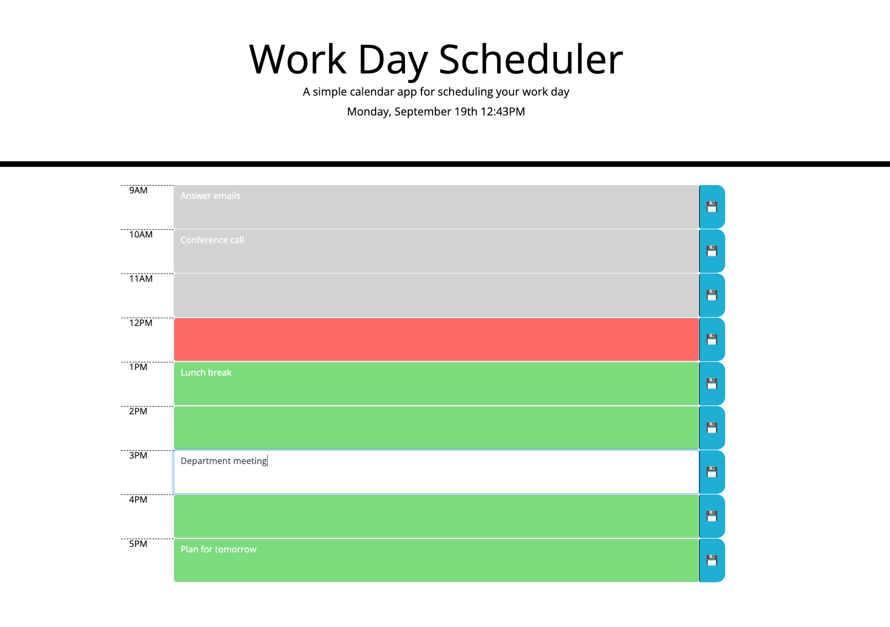

# work-day-scheduler

## Description
This application displays a daily planner that allows the user to plan their day. By using color coded time blocks the user is easily able to keep track of where they are in their day and add events to their schedule accordingly.

## Installation
N/A

## Usage
Deployed application can be found [here.](https://braddwagner.github.io/work-day-scheduler)
Upon opening the user will find the current date and time displayed at the top of the page. Below they will find a time block for standard business hours which will be color coded- grey for hours that have passed, red for the current hour, and green for up coming hours. 

Each time block allows allows the user to enter events to plan their day, and they may save those events using the save icons to the right. Events will be saved in local storage and will automatically populate if the page is refreshed.

## Credits
N/A

## License
Please refer to the LICENSE in the repo.